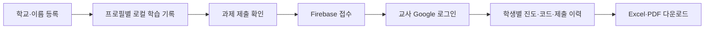

# 학생 과제 제출 구현 결과

작성일: 2026-09-10

## 현재 상태

로컬 구현과 아래 검증을 마쳤으며, 실제 Firebase 프로젝트 구성, 학생 제출 HTTP 200 접수, Google 교사 인증 후 제출 목록·진도·코드 조회까지 확인했다. 초기 403은 미게시 Rules 초안 때문이었고 정식 게시 후 해결됐다. 이번 승인에 따라 이 구현을 커밋·푸시하고 GitHub Pages에 공개 배포한다.

프로젝트는 `python-bite-class-wbmaker01`이며 지정 계정 `wbmaker01@gmail.com`으로 생성했다. Spark, 서울 `asia-northeast3`, 익명 및 Google 인증을 사용한다. 제출 전에는 학생 정보·진도·코드를 전송하지 않으며, 학생 인증도 명시적인 제출 시점에 시작한다.

## 구현 내용

- 학교·이름 로컬 프로필, 기존 비로그인 기록의 선택적 이관, 프로필별 진도·현재 단계·코드 분리.
- 제출 미리보기와 접수 확인, 응답 유실 시 같은 제출본 재시도, 이전 제출본 취소 및 새 제출본 생성.
- 성공 여부와 함께 제출 시 코드·마지막 실행 코드·마지막 성공 코드 보관.
- 숨은 교사 진입, 지정 Google 계정 기반 접근 제한, 학생별 최신 제출과 과거 제출 조회.
- 개인별 Excel 4개 시트 및 한글 PDF 다운로드. 보고서에는 학교·이름·진도·코드 포함.
- Firestore 규칙, 설정 예시, 업데이트 내역, 관련 자동화 검증 추가.

## 검증 결과

| 검증 | 결과 |
| --- | --- |
| 전체 앱 테스트 | 23개 파일 중 22개 통과·1개 조건부 건너뜀, 109개 테스트 통과·3개 조건부 건너뜀 |
| ESLint | 통과 |
| TypeScript 및 프로덕션 빌드 | 통과 |
| Firestore 에뮬레이터 | 13개 통과, 실제 REST 중복 접수 409 및 서버 시각 포함 |
| Excel 산출물 | 4개 시트, 수식처럼 시작하는 코드의 문자열 저장 및 여러 줄 코드 확인 |
| PDF 산출물 | 실제 한글 폰트로 2쪽 생성, 화면 렌더링 및 한글 추출 확인 |
| 변경 공백 검사 | git diff --check 통과 |
| 로컬 앱 | http://localhost:5173/ HTTP 200 |

조건부 PDF QA 테스트 3개는 기본 실행에서 건너뛰며 실제 폰트를 사용한 산출물과 브라우저 다운로드를 별도로 확인했다. 빌드에는 큰 청크 경고가 남아 있으며 보고서 모듈은 다운로드 시 지연 로드한다. ego-browser에서 로컬 화면의 951px 및 390px 너비를 확인했고 가로 넘침은 없었다. 실제 브라우저의 Firebase 접수는 후속 진단·게시 후 HTTP 200으로 성공했고, 사용자 Google 동의 후 교사 조회까지 확인했다.

## 확인 링크

- [로컬 앱](http://localhost:5173/)
- [공개 앱](https://wbmaker2.github.io/python-bite-class/)
- [Firebase 콘솔](https://console.firebase.google.com/u/1/project/python-bite-class-wbmaker01/overview)
- [구현 계획](firebase-submission-implementation-plan-2026-09-10.md)
- [Firebase 설정 기록](firebase-setup-2026-09-10.md)
- [샘플 PDF](../output/firebase-report-qa/student-report.pdf)
- [샘플 Excel](../output/firebase-report-qa/student-report.xlsx)

## 남은 작업

사용자의 새 작업 공간 승인 후 TaskSpace 19에서 Firebase 설정을 완료했다. 가상 QA 학생 `Firebase QA 학교 · 김QA학생`으로 최초 제출, 같은 제출 재시도, 이전 제출 폐기 후 새 제출의 세 차례 모두 실제 REST commit이 403 `Missing or insufficient permissions`를 반환했다.

실제 제출 자료(62행, progressJson 19,872자)를 로컬 에뮬레이터에 대입한 저장·조회는 통과했다. 이후 새 승인 진단에서 편집기에 보인 규칙이 미게시 초안임을 확인했다. 앞선 ‘게시 완료’ 판단은 부정확했으며, 이 확인 오류를 정정한다.

세 차례 실패 후 사용자 승인으로 진단을 재개했다. 실제 REST 프로젝트·DB, Firebase ID 토큰 issuer/audience/provider/UID, 루트 필드 및 서버 시각 transform을 비교해 모두 일치함을 확인했다. 검토된 규칙을 게시하고 새 active release(22:22) 및 새로고침 후 본문 유지를 확인한 뒤 같은 pending 제출이 성공했다. 보안 규칙을 완화하지 않았다.

- 실제 접수 ID: `50e66de1-8b1b-471b-8833-d2a2cb0eb488`
- 서버 접수 시각: 2026-09-10 22:25:25 KST
- 새 진단의 실제 제출 요청: 게시 전 403 1회, 게시 후 200 1회
- 교사 인증: 사용자 Google 동의 후 지정 계정 인증 성공. 실제 QA 제출 목록, 0/57 제출 당시 진도, 제출 코드 및 서버 시각 조회 확인.

## 학생용 PDF 후속 구현 결과

학생 본인의 PDF 다운로드를 구현했다. 목차 하단 ‘내 학습 리포트’와 학생 정보 창에서 진입하고, 전체/현재 장 범위 및 코드 포함 여부를 선택할 수 있다. 로컬 프로필·진도를 복사하여 생성하므로 PDF 저장으로 과제가 전송되거나 Firebase 학생 인증이 시작되지 않는다. 로컬 PDF는 작성 시각을 표시하며 서버 접수 시각이나 제출 ID를 만들지 않는다.

등록/기존 학생 선택 후 리포트 복귀, 취소 시 복귀 의도 제거, 코드 없이 실행 결과 보존, 한국 날짜 파일명, 생성 중 최초 학생 스냅샷 고정, 중복 클릭 방지, 오류 후 재시도를 확인했다. 한글 폰트와 라이선스를 앱의 정적 자산으로 포함했다.

- 최종 전체 검사(관리자 목록 개선 포함): 23개 테스트 파일 중 22개 통과·1개 조건부 건너뜀, 109개 테스트 통과·3개 조건부 건너뜀. ESLint, TypeScript 및 프로덕션 빌드 통과.
- 실제 폰트 산출물 검사: 기본 요약 A4 2쪽, 코드 포함 A4 9쪽. 한글 렌더링과 페이지 크기를 직접 확인했다.
- [기본 요약 PDF](../output/student-report-qa/student-report-summary.pdf)
- [코드 포함 PDF](../output/student-report-qa/student-report-code.pdf)
- [실행 계획과 리뷰 기준](student-report-and-firebase-diagnosis-plan-2026-09-10.md)

실제 브라우저에서도 학생 리포트 다운로드를 확인했다. 전체 요약은 2쪽, 현재 1장 코드 포함본은 1쪽이며 학교·이름·로컬 작성 시각·1/4 범위·코드 포함을 텍스트 추출로 확인했다. 서버 접수 시각과 제출 ID는 포함되지 않았다. 다운로드 중 Firebase/Auth 요청은 0건이고 번들 한글 폰트 사용을 확인했다.

390px 모바일에서 가로 넘침 없이 PDF와 닫기 버튼이 화면 안에 보이고 실제 다운로드됐다. 초기 QA에서 발견한 긴 목록 스크롤 문제는 고정 하단 액션으로 수정했다. 학생의 현재 로컬 진도는 1/57로 진행됐지만 서버 제출본의 0/57은 그대로 유지되어 제출 시점 기록과 현재 기록이 분리됨도 확인했다.

## 관리자 목록 후속 개선

검색어 없이 전체 제출 학생을 보여 주고, 학생별 최신 제출 시각 내림차순으로 10명씩 페이지를 나눈다. 검색하면 첫 페이지로 돌아가며, 새로고침 시 유효한 페이지로 보정한다. 같은 학생의 과거 제출은 학생 아래에서 펼쳐 보고 페이지 인원수에는 중복 계산하지 않는다.

실제 브라우저에서 검색 입력이 빈 상태로 학생 목록이 표시되고 390px 화면에서 가로 넘침이 없음을 확인했다. 10명을 넘는 경계는 로컬의 가상 제출 자료를 사용하는 자동화 테스트로 검증하며, 페이지 테스트를 위해 운영 DB에 다수의 가상 학생을 추가하지 않았다.

0/10/11/21명 경계, 최신 제출 정렬과 동명이인 분리, 한 학생의 과거 제출, 검색 후 첫 페이지 복귀, 새로고침 후 페이지 보정, 페이지 밖 상세 선택 해제 및 많은 페이지의 생략 부호를 검증했다. 모바일 목록에서 학교·이름과 제출 시각을 줄바꿈하여 구분했다.
