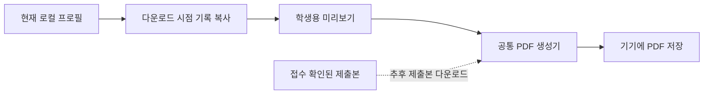

# 학생용 학습 리포트 PDF 제안

작성일: 2026-09-10. 최초 제안 후 사용자의 후속 승인에 따라 1차 학생용 로컬 PDF 기능을 구현했다. 아래의 제출본 리포트는 추후 확장 아이디어다. 구현·검증 범위는 [실행 계획](student-report-and-firebase-diagnosis-plan-2026-09-10.md)에 기록했다.

## 추천 방향

학생이 현재 브라우저의 자기 프로필 학습 기록을 PDF로 내려받도록 한다. 과제 제출 없이 사용할 수 있으며 PDF 생성 자체는 학교·이름·진도·코드를 Firebase에 전송하지 않는다. 다운로드와 교사에게 제출하는 행위를 분리한다.

기존 교사용 PDF 생성기와 단계 상태 계산을 재사용하되, 보고서 자료의 출처를 명시적으로 구분한다. 현재 PDF 생성기는 ‘제출 ID’, ‘서버 접수 시각’, ‘제출 당시 상태’를 사용하므로 단순히 버튼만 연결하면 안 된다.

| 종류 | 자료 기준 | 보고서 표시 | 추천 도입 순서 |
| --- | --- | --- | --- |
| 현재 학습 리포트 | 현재 선택한 로컬 프로필 | 작성 시각, 이 기기의 현재 학습 기록 | 1차 기본 기능 |
| 제출본 리포트 | 서버가 접수한 정확한 제출본 | 제출 ID, 서버 접수 시각, 제출 당시 기록 | 2차 또는 제출 완료 화면 확장 |

PDF 파일의 진도는 브라우저에 저장된 학습 기록을 바탕으로 한다. 서버 채점 또는 교사의 확인을 의미하는 인증서 표현은 사용하지 않는다.

## 화면 구성

상단의 로그인 오른쪽 ‘과제 제출’ 위치를 유지하고, 왼쪽 학습 목차 하단의 ‘전체 진도’ 바로 아래에 ‘내 학습 리포트’ 버튼을 둔다. 951px 너비의 현재 앱 화면을 실제 확인했으며, 상단보다 이 위치가 학습 현황과 가깝고 여유가 있다. 모바일에서는 목차를 열었을 때 같은 위치에 제공하고, 학생 이름을 눌렀을 때에도 리포트 진입 동작을 둘 수 있다.

```text
파이썬 한입 교실                    [홍길동] [과제 제출]

나의 학습 현황  18 / 42 단계 완료
━━━━━━━━━━━━────────────
[내 학습 리포트]

┌ 내 학습 리포트 ──────────────────────── [닫기] ┐
│ 한입중학교 · 홍길동                              │
│ 이 기기에 저장된 현재 학습 기록입니다.            │
│                                                │
│ 완료 18 / 42 단계       이어서 배울 단계 5.2       │
│ 장별 진도                                      │
│ 1장 ██████████  6/6                             │
│ 2장 ██████────  3/5                             │
│                                                │
│ 보고서 범위  [전체 학습 ▾]                       │
│ ☐ 작성한 코드도 포함                            │
│                                                │
│ PDF 저장만으로 과제가 제출되지는 않습니다.        │
│                              [PDF 내려받기]      │
└────────────────────────────────────────────────┘
```

위 숫자와 이름은 설명용 가상 예시다. 실제 구현 시 현재 교육과정과 선택된 프로필의 값으로 계산한다.

## 세부 UI 제안

- 처음에는 ‘전체 학습’과 ‘현재 장’ 두 범위만 제공한다. 여러 장 선택은 실제 필요가 생기면 추가한다.
- 코드 포함 옵션은 기본 해제한다. 학생·보호자가 읽기 쉬운 요약을 먼저 제공하고, 코드까지 보관하려는 학생은 선택하도록 한다.
- 학교·이름이 없으면 같은 창에서 입력하거나 기존 로컬 로그인 창으로 안내한다. 이름 없이 임시 기록을 내보내는 기능은 1차 범위에서 제외한다.
- 기록이 없으면 ‘아직 완료한 단계가 없어요. 학습 후 리포트를 만들어 보세요.’와 학습으로 돌아가기 동작을 제공한다.
- ‘PDF 내려받기’만 해당 창의 주 버튼으로 강조한다. 만드는 동안 ‘PDF 만드는 중…’ 표시와 중복 클릭 방지를 제공하고, 실패하면 현재 창에서 다시 시도하게 한다.
- 제출 완료 화면에는 향후 ‘방금 제출한 리포트 PDF’ 보조 버튼을 제공할 수 있다. 서버 접수 확인 전에는 제출본 리포트라고 표시하지 않는다.

## PDF 내용

1. 학교·이름, 작성 시각, 전체/현재 장 범위.
2. 완료 단계 수와 장별 진도. ‘완료’와 ‘최근 실행 성공’은 다른 항목으로 표시한다.
3. 단계별 상태: 읽기 완료, 실행 성공, 다시 확인할 단계, 수정 후 미실행, 미시도. 과거 완료이나 실행 근거가 없는 기록도 구분한다.
4. 이어서 학습할 단계 또는 다시 실행할 단계. 저장된 상태에 따른 단순 안내로 만들고 AI 평가를 추가하지 않는다.
5. 선택했을 때만 코드 부록: 현재 작성 코드와 마지막 실행 결과. 코드가 달라졌다면 실행 당시 코드 또는 마지막 성공 코드를 구분해 표시한다.

요약은 1~2쪽을 목표로 하되, 전체 단계 수와 코드 길이에 따라 자연스럽게 여러 쪽으로 나눈다. 긴 한글·코드·들여쓰기를 보존하고 단계 제목만 쪽 끝에 남지 않도록 한다.

## 구현 구조



- 보고서 입력에 `source: local | submission`, `generatedAt`, 범위, 코드 포함 여부를 둔다. 로컬 보고서는 서버 시각이나 제출 ID를 만들어 넣지 않는다.
- 기존 제출용 자료 생성기의 전송 크기 제한을 로컬 PDF에 무조건 적용하지 않는다. 전체 코드가 필요하면 로컬 원본을 사용하고, 성능상 제한이 필요할 경우 생략 사실을 명시한다.
- 생성 버튼을 누르는 순간 프로필·진도·코드를 복사한다. 생성 중 프로필을 바꿔도 다른 학생 자료가 섞이지 않도록 한다.
- PDF 모듈은 버튼을 누를 때 불러온다. 현재 외부 CDN에서 가져오는 한글 폰트는 앱의 정적 자산으로 포함하는 방향을 권장한다. 완전한 오프라인 이용은 앱과 폰트의 캐시 설계까지 필요하므로 별도 보장하지 않는다.
- 파일명 예: `한입중학교_홍길동_학습리포트_2026-09-10.pdf`.
- 로컬 자료만 사용하므로 1차 기능에 새로운 Firestore 규칙이나 학생 서버 로그인은 필요하지 않다. 같은 이름 입력만으로 다른 기기의 기록을 복구하는 기능은 제공하지 않는다.

## 구현 후 확인할 항목

프로필 격리, 다운로드 시 학생 자료 전송 없음, 현재/제출본 표기 구분, 빈 기록 안내, 코드 미포함/포함, 한글·긴 코드 페이지 나눔, 모바일 다운로드, 생성 중 중복 클릭과 오류 회복을 검증한다.
